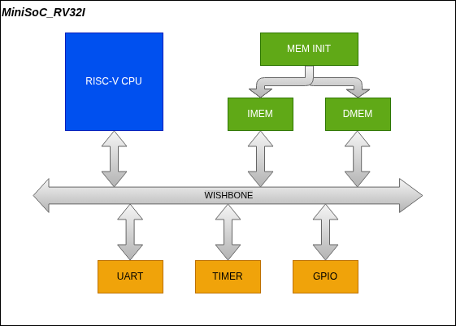
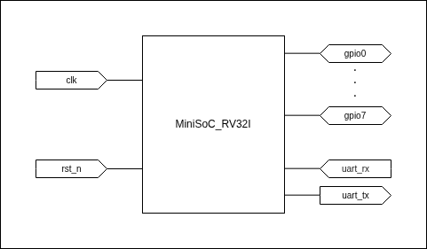

# MiniSoC_RV32I

A minimalist System-on-Chip (SoC) built around a custom RV32I RISC-V core, using the **Wishbone bus** as the interconnect.  
The project is focused on **learning and experimentation** in VLSI/ASIC/FPGA design, keeping the design simple and modular.

---

## 🚀 Project Goals
- Implement a simple RV32I CPU core (no interrupts, no MMU, no caches).
- Integrate basic peripherals: **UART, Timer, GPIO**.
- Use **Wishbone** as the interconnect fabric.
- Provide software toolchain integration with a linker script and test programs.
- Allow simulation and program execution.

---

## SoC Architecture





### RISC-V CPU Architecture


**Pipeline Details**

The core implements a classic 5-stage RISC pipeline:

1. **Fetch (IF)**: Fetches instructions via the Wishbone bus.
2. **Decode (ID)**: Decodes the instruction and reads the Register File.
3. **Execute (EX)**: ALU operations and branch target calculations.
4. **Memory (MEM)**: Data memory access (Load/Store).
5. **Writeback (WB)**: Writes results back to the Register File.

A dedicated **Hazard Unit** manages data hazards (via Forwarding) and control hazards (via Flush/Stall), allowing the CPU to execute most instructions in a single cycle (IPC ≈ 1).

---

## 📂 Repository Structure
```text
├── build                               # Build folder
├── docs                                # Documentation folder
├── scripts                             # Utils scripts (setup)
├── sim                                 # Simulation Environment + Testbenches
├── sim_minisoc                         # MiniSoC Complete System Simulation (use C-generated firmware)
├── src                                 # RTL Source Code (Verilog)
│   ├── bus
│   ├── common
│   ├── cpu
│   ├── mem
│   ├── pad
│   ├── peripheral
│   └── top
├── sw                                  # Software (C/ASM programs, linker script)
└── synth                               # Synthesis and FPGA Build
```


---

## 🧩 Memory Map
| Region       | Base Address | Size    | Notes                       |
|--------------|--------------|---------|-----------------------------|
| **IMEM**     | `0x0000_0000`| 32 KB   | Instruction memory          |
| **DMEM**     | `0x1000_0000`| 16 KB   | Data memory                 |
| **UART**     | `0x2000_0000`| 4 KB    | UART registers              |
| **TIMER**    | `0x3000_0000`| 4 KB    | Timer registers             |
| **GPIO**     | `0x4000_0000`| 4 KB    | General-purpose I/O         |

---

## 🐛 Architecture Notes & "War Stories"

Building this SoC from scratch exposed several classic computer architecture challenges. Here is how they were solved:

### 1. The "Load-Use Deadlock" (Pipeline Hazard)

**The Challenge**: In a 5-stage pipeline, a Load-Use hazard occurs when an instruction in Execute (EX) needs a value currently being loaded from memory (MEM). Initially, the Hazard Unit reacted by freezing the Decode stage (`stall_decode=1`) AND flushing the Execute stage (`flush_execute=1`). This created a fatal hardware deadlock: the dependent instruction was endlessly restarted and killed.

**The Solution**: Strict application of the *Golden Rule of RISC Pipelines*: "Stall upstream, let downstream flow, and insert a bubble." The logic was corrected to freeze Fetch (`stall_fetch=1`), flush only the intermediate register (`flush_decode=1`), and leave the Execute stage alone, allowing the memory load to safely complete.

### 2. The "Ghost ACK" (Wishbone Bus)

**The Challenge**: The UART peripheral responded to CPU requests by asserting the `ACK` signal for one cycle. However, due to interconnect delays, the UART could still see the `CYC` signal as active on the next clock cycle, generating a phantom second `ACK`. During rapid back-to-back writes, this "Ghost ACK" completely desynchronized the CPU, corrupting UART string transmissions.

**The Solution**: Implemented an `ack_done` lock register in all Wishbone slave peripherals. This guarantees that the `ACK` signal strictly falls back to zero after a transaction, forcing the bus master (CPU) to drop its request before any new transaction can begin.

### 3. Simulation RTL vs. Real Time

Simulating a complete C firmware on a cycle-accurate Verilog model poses significant timing challenges:

- **Software Delays**: A simple 500ms C delay at 100 MHz takes 50 million cycles, freezing the simulation for minutes. The C source code was adapted with preprocessor macros (`SIMULATION_MODE`) to reduce delays to 1 ms during RTL testing.

- **UART Buffering**: To simulate a clean UART terminal without the stuttering caused by the massive speed difference between the CPU and the baud rate, the testbench uses a line buffer. It leverages Verilog's **Multi-Channel Descriptors (MCD)** (`log_file | 1`) to write synchronously and atomically to both a `.log` file and the system console.

---

## 🛠️ Simulation & Execution

### Prerequisites
- **Icarus Verilog**        – Simulation
- **GTKWave**               – Waveform visualization
- **Yosys** + **nextpnr**   – Synthesis and FPGA mapping
- **RISC-V GCC toolchain**  – Compile test programs

A setup script is provided to verify your environment:
```bash
make check_env
```

### Running the Complete SoC Simulation
To compile the C firmware, build the Verilog SoC, and launch the interactive testbench:
```bash
make sim-minisoc-run
```

The testbench will automatically track the Program Counter, monitor the Wishbone bus, and display UART/GPIO activity directly in your terminal:

```text
[UART TERMINAL] Mini RV32I SoC Firmware Started
[UART TERMINAL] ================================
[UART TERMINAL] System Clock: 100000000 Hz
[UART TERMINAL] UART Baud:    115200 bps
[UART TERMINAL] Memory:       32KB IMEM + 16KB DMEM
[UART TERMINAL] ================================
[UART TERMINAL] LED Blink Demo Started
[GPIO] LED 0: 🟢 ON   (Time: 22573945000 ns)
[GPIO] LED 0: ⚪ OFF  (Time: 23619175000 ns)
```

---

## 📖 References
- [RISC-V Spec](https://riscv.org/specifications/ratified/)
- [RISC-V GNU Toolchain](https://github.com/riscv/riscv-gnu-toolchain)
- [Wishbone b4](https://cdn.opencores.org/downloads/wbspec_b4.pdf)
