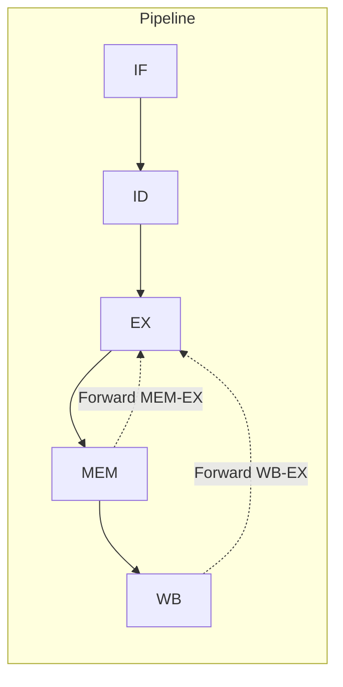

# CPU Pipeline Architecture

## 1. Overview

The MiniSoC-RV32I CPU implements a classic 5-stage RISC pipeline optimized for the RV32I instruction set. This document details the pipeline structure, hazard handling, and performance characteristics.

### 1.1 Pipeline Summary

| Stage     | Name                  | Function                                      | Key Components                        |
|-----------|-----------------------|-----------------------------------------------|---------------------------------------|
| **IF**    | Instruction Fetch     | Fetch instruction from IMEM                   | PC logic, Wishbone master             |
| **ID**    | Instruction Decode    | Decode instruction, read registers            | Control unit, Register file           |
| **EX**    | Execute               | Perform ALU operations, calculate addresses   | ALU, Branch unit                      |
| **MEM**   | Memory Access         | Access data memory                            | Wishbone master, Load/store logic     |
| **WB**    | Writeback             | Write results to register file                | Writeback mux, Register file write    |

### 1.2 Pipeline Block Diagram


```text
┌─────────────────────────────────────────────────────────────────────────────────┐
│                        5-Stage RISC-V Pipeline                                  │
├─────────────────────────────────────────────────────────────────────────────────┤
│                                                                                 │
│   ┌──────────┐   ┌──────────┐   ┌──────────┐   ┌──────────┐   ┌──────────┐      │
│   │   IF     │   │   ID     │   │   EX     │   │   MEM    │   │   WB     │      │
│   │  Stage   │   │  Stage   │   │  Stage   │   │  Stage   │   │  Stage   │      │ 
│   └────┬─────┘   └────┬─────┘   └────┬─────┘   └────┬─────┘   └────┬─────┘      │
│        │              │              │              │              │            │
│   ┌────▼─────┐   ┌────▼─────┐   ┌────▼─────┐   ┌────▼──────┐   ┌────▼──────┐    │
│   │ PC + 4   │   │ Register │   │   ALU    │   │  Memory   │   │ Writeback │    │
│   │ Next PC  │   │ File     │   │ Execute  │   │  Access   │   │   Mux     │    │
│   │          │   │ Read     │   │          │   │           │   │           │    │
│   └──────────┘   └──────────┘   └──────────┘   └───────────┘   └───────────┘    │
│        │              │              │              │              │            │
│   ┌────▼──────────────▼──────────────▼──────────────▼──────────────▼────┐       │
│   │                        Hazard Detection Unit                        │       │
│   │                          Forwarding Unit                            │       │
│   └─────────────────────────────────────────────────────────────────────┘       │
│                                                                                 │
└─────────────────────────────────────────────────────────────────────────────────┘
```


## 2. Pipeline Stages in Detail

### 2.1 IF Stage (Instruction Fetch)

**Module:** `fetch_stage.v`

#### 2.1.1 Function
- Fetch 32-bit instruction from instruction memory
- Calculate next PC (PC + 4)
- Handle branch/jump redirection

#### 2.1.2 Interface
```verilog
module fetch_stage #(
    parameter RESET_PC   = 32'h0000_0000,
    parameter ADDR_WIDTH = 32,
    parameter DATA_WIDTH = 32
) (
    // Wishbone IMEM interface
    output reg  wbm_imem_cyc, wbm_imem_stb,
    output wire [ADDR_WIDTH-1:0] wbm_imem_addr,
    input  wire [DATA_WIDTH-1:0] wbm_imem_data_read,
    input  wire wbm_imem_ack,
    
    // Pipeline control
    input  wire flush,           // Branch/jump taken
    input  wire [ADDR_WIDTH-1:0] new_pc,  // Branch target
    input  wire stall,           // Hazard stall
    
    // Pipeline output
    output reg [DATA_WIDTH-1:0] instr_out,
    output reg [ADDR_WIDTH-1:0] pc_out,
    output reg valid_out
);
```

#### 2.1.3 Key Features
- **Wishbone master** for instruction fetch
- **Flush support** for branch misprediction
- **Stall support** for pipeline hazards
- **Reset PC** configurable (default: 0x0000_0000)


### 2.2 ID Stage (Instruction Decode)

**Module:** `decode_stage.v`

#### 2.2.1 Function
- Decode instruction fields (opcode, funct3, funct7)
- Read register file (rs1, rs2)
- Generate immediates for all instruction formats
- Generate control signals

#### 2.2.2 Instruction Decoding

| Instruction Type  | Immediate Format              | Example Instructions  |
|-------------------|-------------------------------|-----------------------|
| **I-type**        | `inst[31:20]` sign-extended   | `addi`, `lw`, `jalr`  |
| **S-type**        | `{inst[31:25], inst[11:7]}`   | `sw`                  |
| **B-type**        | Complex branch offset         | `beq`, `bne`          |
| **B-type**        | `inst[31:12] << 12`           | `lui`, `auipc`        |
| **J-type**        | Complex jump offset           | `jal`                 |


#### 2.2.3 Control Signals Generated

| Signal        | Width | Function                      |
|---------------|-------|-------------------------------|
| `reg_write`   | 1     | Write to register file        |
| `mem_write`   | 1     | Memory write operation        |
| `mem_read`    | 1     | Memory read operation         |
| `mem_to_reg`  | 2     | 00: ALU, 01: MEM, 10: PC+4    |
| `branch`      | 1     | Branch instruction            |
| `alu_src`     | 1     | 0: rs2, 1: immediate          |
| `alu_op`      | 4     | ALU operation code            |
| `jump`        | 1     | Jump instruction              |


### 2.3 EX Stage (Execute)

**Module:** `execute_stage.v`

#### 2.3.1 Function
- Perform ALU operations
- Calculate branch targets and conditions
- Handle forwarding for data hazards

#### 2.3.2 ALU Operations

| ALU Op Code   | Operation | Instructions              |
| :---          | :---      | :---                      |
| `0000`        | ADD       | `add, addi, load, store`  |
| `1000`        | SUB       | `sub, beq, bne`           |
| `0001`        | SLL       | `sll, slli`               |
| `0010`        | SLT       | `slt, slti`               |
| `0011`        | SLTU      | `sltu, sltiu`             |
| `0100`        | XOR       | `xor, xori`               |
| `0101`        | SRL       | `srl, srli`               |
| `1101`        | SRA       | `sra, srai`               |
| `0110`        | OR        | `or, ori`                 |
| `0111`        | AND       | `and, andi`               |
| `1100`        | PASSB     | `lui` (pass operand B)    |


#### 2.3.3 Forwarding Logic
```verilog
// Forwarding selection codes
localparam [1:0] FROM_REG  = 2'b00;
localparam [1:0] FROM_MEM  = 2'b01;
localparam [1:0] FROM_WB   = 2'b10;

assign rs1_data_forwarded = 
    (forward_rs1 == FROM_MEM) ? mem_alu_result :  // From MEM stage
    (forward_rs1 == FROM_WB)  ? wb_result      :  // From WB stage
    rs1_data_in;                                  // From register file
```

### 2.4 MEM Stage (Memory Access)

**Module**: `mem_stage.v`

#### 2.4.1 Function
- Perform load/store operations
- Handle byte/half-word/word accesses
- Generate Wishbone transactions for data memory

#### 2.4.2 Memory Access Types

| funct3    | Type  | Size      | Alignment | Sign-extend   |
| :---      | :---  | :---      | :---      | :---          |
| `000`     | LB    | Byte      | Any       | Yes           |
| `001`     | LH    | Half-word | 2-byte    | Yes           |
| `010`     | LW    | Word      | 4-byte    | No            |
| `100`     | LBU   | Byte      | Any       | No            |
| `101`     | LHU   | Half-word | 2-byte    | No            |
| `000`     | SB    | Byte      | Any       | N/A           |
| `001`     | SH    | Half-word | 2-byte    | N/A           |
| `010`     | SW    | Word      | 4-byte    | N/A           |


#### 2.4.3 Wishbone Interface
- Separate Whishbone master for data memory
- Handles multi-cycle memory operations
- Generate byte select signals based on access type


### 2.5 WB Stage (Writeback)

**Module**: `writeback_stage.v` (Note: Module name is `wb_stage.v` in RTL)

#### 2.5.1 Function
- Select data to write to register file (ALU, memory, or PC+4)
- Write to register file
- Provide data for forwarding

#### 2.5.2 Writeback Sources

| mem_to_reg    | Source        | Description                   |
| :---          | :---          | :---                          |
| `00`          | ALU result    | R-type, I-type, LUI, AUIPC    |
| `01`          | Memory data   | Load Instructions             |
| `20`          | PC + 4        | JAL, JALR (return address)    |


## 3. Hazard Handling
### 3.1 Data Hazards
#### 3.1.1 Forwarding Paths



#### 3.1.2 Forwarding Priority
1. **MEM stage** (highest priority) - Most recent result
2. **WB stage** - Older result
3. **Register file** - Default source


### 3.2 Control Hazards
#### 3.2.1 Branch Handling
- **Prediction**: Always "not taken"
- **Penalty**: 2 cycles when taken (flush IF, ID)
- **Detection**: EX stage calculates branch outcome

#### 3.2.2 Jump Handling
- **JAL/JALR**: Always taken, 2 cycle penalty
- **Return address**: PC+4 written to register file

### 3.3 Structural Hazards
#### 3.3.1 Memory Conflicts
- **Separate IMEM/DMEM**: No structural hazards for instruction/data access
- **IMEM dual-port**: System can read IMEM while CPU fetches


#### 3.3.2 Register File
- **2 read ports, 1 write port**: Supports full pipeline operation
- **Write in first half, read in second half**: No structural hazard


## 4. Pipeline Registers

### 4.1 IF/ID Register
```verilog
// Signals passed from IF to ID
IF_to_ID_instr    // 32-bit instruction
IF_to_ID_pc       // PC of this instruction  
IF_to_ID_valid    // Instruction valid (not bubble)
```


### 4.2 ID/EX Register
```verilog
// Control signals
ID_to_EX_reg_write, mem_write, mem_read, branch, jump, alu_src
ID_to_EX_mem_to_reg  // 2-bit
ID_to_EX_alu_op      // 4-bit

// Data signals  
ID_to_EX_rs1_data, rs2_data, imm
ID_to_EX_rs1_addr, rs2_addr, rd_addr
ID_to_EX_pc, instr
ID_to_EX_opcode, funct3, funct7
```


### 4.3 EX/MEM Register
```verilog
// Control signals (propagated)
EX_to_MEM_reg_write, mem_write, mem_read
EX_to_MEM_mem_to_reg, funct3

// Data signals
EX_to_MEM_alu_result  // ALU result or address
EX_to_MEM_mem_data    // Data to store
EX_to_MEM_rd          // Destination register
EX_to_MEM_pc_plus_4   // For JAL/JALR
```


### 4.4 MEM/WB Register
```verilog
// Control signals
MEM_to_WB_reg_write
MEM_to_WB_mem_to_reg

// Data signals
MEM_to_WB_alu_result  // ALU result
MEM_to_WB_mem_result  // Loaded data
MEM_to_WB_pc_plus_4   // Return address
MEM_to_WB_rd          // Destination register
```


## 5. Hazard Detection Unit

**Module**: `hazard_unit.v`

### 5.1 Hazard Types Detected

#### 5.1.1 Load-Use Hazard
```text
Cycle  Instruction in EX    Instruction in ID    Action
-----  ------------------  -------------------  -------
  0    lw x1, 0(x2)        add x3, x1, x4       STALL
  1    lw x1, 0(x2)        (bubble)             Forward
  2    (in MEM)            add x3, x1, x4       Normal
```

**Detection**: `ex_mem_read && (id_rs1 == ex_rd || id_rs2 == ex_rd)`


#### 5.1.2 EX-to-ID Hazard
```text
Cycle  Instruction in EX    Instruction in ID    Action
-----  ------------------  -------------------  -------
  0    auipc x1, ...       addi x2, x1, 100     STALL
  1    auipc x1, ...       (bubble)             Forward
  2    (in MEM)            addi x2, x1, 100     Normal
```

**Detection**: `ex_reg_write && (id_rs1 == ex_rd || id_rs2 == ex_rd)`


#### 5.1.3 Memory Busy Hazard
- Memory operation takes multiple cycles
- Stall entire pipeline until memory acknowledges


### 5.2 Stall Signals

| Signal            | Affected Stages   | Purpose                       |
| :---              | :---              | :---                          |
| `stall_fetch`     | IF                | Stop new instruction fetch    |
| `stall_decode`    | ID                | Hold decode stage             |
| `stall_execute`   | EX                | Hold execute stage            |
| `stall_mem`       | MEM               | Hold memory stage             |
| `stall_writeback` | WB                | Hold writeback stage          |


### 5.3 Flush Signals

| Signal            | Affected Stages   | Purpose                       |
| :---              | :---              | :---                          |
| `fetch_fetch`     | IF                | Clear fetch stage (branch)    |
| `fetch_decode`    | ID                | Clear fetch stage (branch)    |
| `fetch_execute`   | EX                | Clear fetch stage (branch)    |


## 6. Performance Analysis

### 6.1 Ideal Pipeline Timing
```text
Cycle  IF    ID    EX    MEM   WB    Instruction
-----  ---   ---   ---   ---   ---   -----------
  0    IF1   -     -     -     -     instr1
  1    IF2   ID1   -     -     -     instr2
  2    IF3   ID2   EX1   -     -     instr3
  3    IF4   ID3   EX2   MEM1  -     instr4
  4    IF5   ID4   EX3   MEM2  WB1   instr5
  5    IF6   ID5   EX4   MEM3  WB2   instr6
```


### 6.2 Hazard Penalties

| Hazard Type       | Penalty (cycles)  | Frequency             | Impact    |
| :---              | :---              | :---                  | :---      |
| `Load-Use`        | 1                 | ~20% of loads         | Moderate  |
| `Branch Taken`    | 2                 | ~20% of branches      | Moderate  |
| `Jump`            | 2                 | ~5% of instructions   | Low       |
| `Memory Busy`     | Variable          | Depends on memory     | Variable  |


### 6.3 CPI Calculation
- **Base CPI**: 1.0 (ideal)
- **Load-Use penalty**: 0.2 (20% of instructions are loads, 1 cycle penalty)
- **Branch penalty**: 0.4 (20% branches, 2 cycles, 50% taken rate)
- **Jump penalty**: 0.1 (5% jumps, 2 cycles)
- **Estimated CPI**: ~1.7 cycles/instruction


## 7. Special Cases and Corner Cases
### 7.1 Zero Register (x0)
- **Reads**: Always return 0
- **Writes**: Ignored (x0 is hardwired to 0)
- **Forwarding**: x0 never needs forwarding (always reads as 0)

### 7.2 Load-Store Alignment
- **HW requirement**: DMEM supports unaligned accesses
- **Detection**: MEM stage detects misalignment
- **Current behavior**: Flag set but no exception

### 7.3 Memory-Mapped I/O
- Peripherals accessed through MEM stage
- Same timing as memory accesses
- No special handling required

### 7.4 Reset Behavior
- **PC**: Starts at RESET_PC (default: 0x0000_0000)
- **Pipeline**: Filled with NOPs (addi x0, x0, 0)
- **Registers**: All cleared except x0 (always 0)


## 8. Verification Points

### 8.1 Critical Paths to Verify
1. **Forwarding paths**: All combinations of MEM→EX, WB→EX
2. **Hazard detection**: Load-use, EX-to-ID, memory busy
3. **Branch resolution**: All branch types (BEQ, BNE, BLT, BGE, BLTU, BGEU)
4. **Memory access**: All sizes (byte, half-word, word) signed/unsigned

### 8.2 Test Scenarions
```asm
// Test 1: Basic ALU forwarding
addi x1, x0, 5    // x1 = 5
addi x2, x1, 10   // Forward from EX to EX

// Test 2: Load-use hazard  
lw   x3, 0(x1)    // Load
addi x4, x3, 1    // Stall then forward from MEM

// Test 3: Branch taken
addi x1, x0, 10
addi x2, x0, 10
beq  x1, x2, label  // Taken, flush pipeline

// Test 4: Jump and link
jal  x1, target    // x1 = PC+4, jump to target
```


## 9. Design Trade-offs
### 9.1 Simplifications Made
1. **No branch prediction**: Simple "not taken" reduces complexity
2. **No exceptions**: Simplifies control logic
3. **Single issue**: No superscalar or out-of-order execution
4. **Fixed latency memory**: Simplifies hazard detection


### 9.2 Optimization Opportunities
1. **Branch prediction**: Add simple 1-bit predictor
2. **Instruction cache**: Reduce IMEM access latency
3. **Store buffer**: Allow stores to complete without stalling
4. **Early branch resolution**: Move to ID stage

