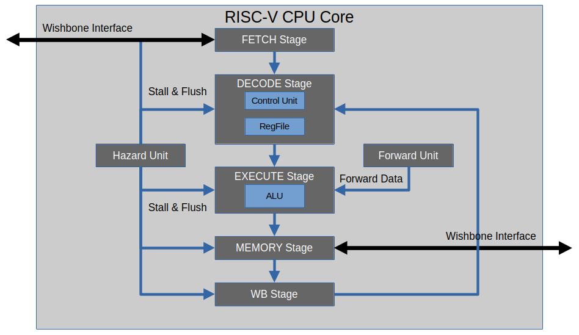

# 02. CPU Pipeline Architecture

## 1. Overview

The MiniSoC-RV32I CPU implements a classic 5-stage RISC pipeline, highly optimized for the RV32I Base Integer Instruction Set.

While the architecture internally resembles a Harvard design (separate Instruction and Data memory ports allowing simultaneous fetch and execution), it interfaces with the system via standard Wishbone B4 buses. The pipeline is fully interlocked, featuring a dedicated Hazard Unit to manage data dependencies, control flow changes, and variable-latency memory bus transactions.

### 1.1 Pipeline Stage Summary

| Stage     | Name                  | Primary Function                                      | Hardware Components                   |
|-----------|-----------------------|-------------------------------------------------------|---------------------------------------|
| **IF**    | Instruction Fetch     | Fetches the next instruction from IMEM.               | PC Register, Wishbone Master (Fetch)  |
| **ID**    | Instruction Decode    | Decodes opcode, reads registers, generates immediate. | Control Unit, Register file (Read)    |
| **EX**    | Execute               | Perform ALU operations and resolves branch conditions.| ALU, Branch Target                    |
| **MEM**   | Memory Access         | Executes Load/Store transactions on the system bus.   | Wishbone master (Data)                |
| **WB**    | Writeback             | Writes ALU or Memory results back to Register file.   | Writeback mux, Register file (Write)  |

### 1.2 Pipeline Block Diagram



```text
┌─────────────────────────────────────────────────────────────────────────────────┐
│                            5-Stage RISC-V Pipeline                              │
├─────────────────────────────────────────────────────────────────────────────────┤
│                                                                                 │
│   ┌──────────┐   ┌──────────┐   ┌──────────┐   ┌──────────┐   ┌──────────┐      │
│   │   IF     │   │   ID     │   │   EX     │   │   MEM    │   │   WB     │      │
│   │  Stage   │   │  Stage   │   │  Stage   │   │  Stage   │   │  Stage   │      │ 
│   └────┬─────┘   └────┬─────┘   └────┬─────┘   └────┬─────┘   └────┬─────┘      │
│        │              │              │              │              │            │
│   ┌────▼─────┐   ┌────▼─────┐   ┌────▼─────┐   ┌────▼──────┐   ┌────▼──────┐    │
│   │ PC + 4   │   │ Register │   │   ALU    │   │  Memory   │   │ Writeback │    │
│   │ Next PC  │   │ File     │   │ Execute  │   │  Access   │   │   Mux     │    │
│   │          │   │ Read     │   │          │   │           │   │           │    │
│   └──────────┘   └──────────┘   └──────────┘   └───────────┘   └───────────┘    │
│        │              │              │              │              │            │
│   ┌────▼──────────────▼──────────────▼──────────────▼──────────────▼────┐       │
│   │                        Hazard Detection Unit                        │       │
│   │                          Forwarding Unit                            │       │
│   └─────────────────────────────────────────────────────────────────────┘       │
│                                                                                 │
└─────────────────────────────────────────────────────────────────────────────────┘
```

---

## 2. Pipeline Stages in Detail

### 2.1 IF Stage (Instruction Fetch)
- **Operation**: Asserts `wbm_imem_cyc` and `wbm_imem_stb` with the current Program Counter (PC).

- **Bus Dependency**: The pipeline relies on `wbm_imem_ack` from the IMEM controller. If the memory requires multiple cycles to return the instruction, the IF stage signals the Hazard Unit to stall the entire pipeline.

- **Control Flow**: Calculates `PC + 4` by default, but accepts a `new_pc` from the EX stage if a branch or jump is taken.


### 2.2 ID Stage (Instruction Decode)
- **Operation**: Analyzes the 32-bit instruction fetched by IF.

- **Register File**: Reads `rs1` and `rs2`. The Register File resolves internal Read-After-Write (RAW) hazards by writing on the first half of the clock cycle and reading on the second half.

- **Immediate Generation**: Extracts and sign-extends immediates based on the instruction type (I-type, S-type, B-type, U-type, J-type).


### 2.3 EX Stage (Execute)
- **Operation**: The Arithmetic Logic Unit (ALU) performs integer operations.

- **Branch Resolution**: Evaluates branch conditions (e.g., `rs1 == rs2` for `BEQ`) and computes the target address. If taken, it signals the Hazard Unit to assert a `FLUSH` to the earlier pipeline stages.

- **Forwarding**: Contains multiplexers controlled by the `forward_unit` to accept bypassed data directly from the MEM or WB stages to resolve RAW data hazards without stalling.


### 2.4 MEM Stage (Memory Access)
- **Operation**: Initiates a Wishbone bus transaction for Load (`LW`, `LB`, etc.) and Store (`SW`, `SB`, etc.) instructions.

- **Alignment**: Generates the 4-bit `wbm_dmem_sel` (Byte Enable) mask based on the `funct3` field and the lowest 2 bits of the calculated address.

- **Bus Dependency**: Operates exactly like the IF stage. If `wbm_dmem_ack` is low, the MEM stage holds the pipeline until the memory or peripheral completes the transaction.


### 2.5 WB Stage (Writeback)
- **Operation**: Selects the final result via the `mem_to_reg` multiplexer:
    - `00`: ALU Result (R-type, I-type)
    - `01`: Memory Read Data (Loads)
    - `10`: `PC + 4` (Return address for `JAL` / `JALR`)

- **Action**: Writes the result to the destination register `rd`.

---

## 3. Harard, Forwarding & Stall Management
The pipeline's integrity is protected by two distinct modules: `forward_unit.v` (which handles data path bypassing) and `hazard_unit.v` (which acts as the central control logic for freezing or flushing the pipeline).

### 3.1 Data Hazards (Forwarding)
Occurs when an instruction depends on the result of an instruction currently further down the pipeline.

- **Solution**: `The forward_unit.v` compares the source registers (`rs1`, `rs2`) in the Decode stage against the destination registers (`rd`) of valid instructions currently in the MEM and WB stages. It outputs `forward_rs1` and `forward_rs2` to control multiplexers in the EX stage.

- **Priority Rules**:
    1. **MEM to EX** (Highest Priority): Forwarding the ALU result from the instruction immediately preceding the current one.
    2. **WB to EX**: Forwarding from an instruction two cycles ahead.


### 3.2 Control Hazards (Branching)
Occurs because branch conditions and jump targets are calculated in the EX stage. By the time a branch is resolved, the IF and ID stages have already fetched and decoded the next two sequential instructions.

- **Prediction**: Static "Always Not-Taken". The pipeline assumes branches are not taken and continues fetching sequentially.

- **Correction (Flush)**: If the EX stage resolves that the branch is taken, the `hazard_unit.v` asserts `flush_fetch` and `flush_decode`. The invalid sequential instructions currently in these stages are replaced by `NOP`s (bubbles), resulting in a **branch penalty**. *(Note: The EX stage is NOT flushed, because it contains the valid branch instruction itself).*


### 3.3 Bus Hazards (Memory Wait States)
Unlike idealized textbook pipelines where memory access takes exactly 1 cycle, real SoC buses (Wishbone) take variable amounts of time.

- **IF Wait State**: If the IMEM is busy or has >1 cycle latency, `wbm_imem_ack` remains low. The Hazard Unit asserts stalls across all 5 stages (`stall_fetch` through `stall_writeback`). The entire CPU freezes.

- **MEM Wait State (The Bottleneck)**: When a `LW` or `SW` reaches the MEM stage, the CPU asserts the Wishbone signals. If accessing a slow peripheral (e.g., UART), `wbs_ack` might take several cycles. The MEM stage asserts `mem_busy` to the Hazard Unit, which forces all 5 stall signals (`stall_fetch` to `stall_writeback`) high. The entire CPU freezes until `mem_ack` is received.

**Load-Use Stall**
Even with the Forwarding Unit, if a `LW` instruction is followed immediately by an instruction that uses its data, the data is not physically available until the MEM stage finishes reading the bus.

- **Detection**: The Hazard Unit checks if `ex_mem_read == 1` and whether the destination `ex_rd` matches either `id_rs1` or `id_rs2`.

- **Action**: The Hazard Unit asserts `stall_fetch` and `stall_decode` to hold the dependent instruction, and asserts flush_execute to insert a bubble (`NOP`) into the EX stage for 1 cycle. This allows the `LW` to reach the WB stage, at which point the Forwarding Unit can bypass the data.

---

## 4. Pipeline Registers
Inter-stage registers isolate the combinational logic of each stage, ensuring synchronous progression. They are equipped with synchronous `clear` (for flushes) and `enable` (for stalls) control pins driven by the Hazard Unit.

| Register      | Key Data Passed Forward                                                                       |
| :---          | :---                                                                                          |
| **IF/ID**     | `instr` (32-bit), `pc`                                                                        |
| **ID/EX**     | `rs1_data`, `rs2_data`, `imm`, `rd_addr`, decoded control flags (`alu_op`, `mem_write`, etc.) |
| **EX/MEM**    | `alu_result` (Address or Math Result), `rs2_data` (Store Data), `rd_addr`, control flags      |
| **MEM/WB**    | `alu_result`, `mem_read_data`, `pc_plus_4`, `rd_addr`, `mem_to_reg` flag                      |

---

## 5. Performance Analysis & Timing Constraints
*Note: The theoretical timings below represent architectural intent. Precise empirical timing calculations (Slack, Critical Path Delay, and exact Effective IPC) will be appended following comprehensive RTL testbench simulation and timing analysis.*

### 5.1 Internal Execution (ALU)
Register-to-Register operations (`ADD`, `SLL`, `XOR`) execute purely within the combinational logic of the EX stage.

- **Throughput**: 1 instruction per cycle.
- **Latency**: 1 cycle (Hidden by pipeline).


### 5.2 Theoretical vs. Effective IPC
While the theoretical peak Instruction-Per-Cycle (IPC) is **1.0**, the Effective IPC is lower due to the architectural reality of the Wishbone bus:

1. **Base CPI (Cycles Per Instruction)**: 1.0 (Ideal)

2. **Branch Penalty**: +0.4 cycles (Assuming 20% of instructions are branches, with a 2-cycle flush penalty, and a 50% taken rate).

3. **Load-Use Penalty**: +0.2 cycles (Assuming 20% of instructions are loads, causing a 1-cycle stall for immediate dependencies).

4. **Memory Bus Wait States**: **Variable**. Every load/store requires at least 1 extra cycle over the Wishbone bus to wait for the `ACK` signal.

**Estimated Effective CPI**: ~1.7 to 2.2 cycles per instruction (depending heavily on peripheral latency and IMEM access speed).

---

## 6. Special Cases and Corner Cases
### 7.1 Zero Register (`x0`)
- **Reads**: Hardwired to `32'h0000_0000`.
- **Writes**: The Register File logic ignores any write enable where `rd == 5'b00000`.
- **Forwarding**: The Forwarding Unit specifically ensures that data is not forwarded when the destination register is `x0` (`rd != 0`) to prevent bypassing dummy data.

### 7.2 Load-Store Alignment
- **HW requirement**: The RV32I specification states that misaligned accesses (e.g., reading a 32-bit Word from address `0x1000_0001`) can trap.
- **Current Behavior**: The `mem_stage.v` decodes the alignment and exposes `load_misaligned` and `store_misaligned` signals. Currently, the hardware does not trap (no exception controller). Misaligned accesses will result in undefined Wishbone byte-select (`sel`) behavior depending on the underlying memory controller. *Software must ensure strict alignment using the `memory.h` HAL.*