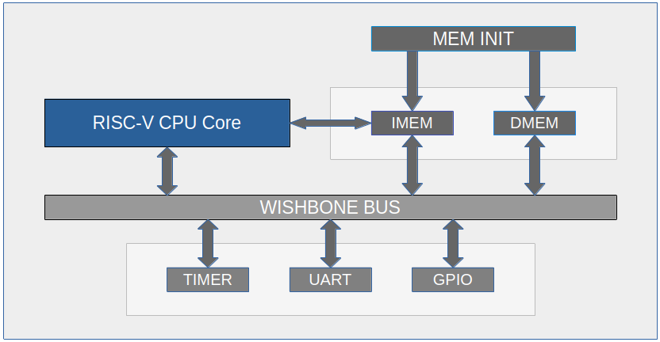

# Mini RV32I SoC - Hardware Architecture

Welcome to the Hardware (RTL) documentation of the Mini RV32I System-on-Chip.
This directory describes the digital design of the custom 32-bit RISC-V CPU, the Wishbone interconnect, and all embedded peripherals written in Verilog.

## Documentation Structure (Top-Down Approach)

01. [SoC Overview](01_SOC_OVERVIEW.md)
Describes the top-level integration (top_soc.v), the synchronized reset tree, and the physical I/O pads.

02. [CPU Pipeline](02_CPU_PIPELINE.md)
Details the 5-stage RISC-V core (fetch, decode, execute, memory, writeback), the Hazard Unit, and data forwarding.

03. [Wishbone Interconnect](03_WISHBONE_INTERCONNECT.md)
Explains the address decoding logic and bus multiplexing between the CPU Master and the memory/peripheral Slaves.

04. [Memory System](04_MEMORY_SYSTEM.md)
Covers the IMEM, DMEM, and the mem_init controller responsible for loading the firmware binary into the simulated ROM.

05. [Peripherals Design](05_PERIPHERALS/)
Detailed register-transfer-level (RTL) descriptions of the UART, GPIO, and Hardware Timer.

---

## High-Level Block Diagram

The SoC is built around a standard Wishbone B4 compatible interconnect. The CPU acts as the sole Bus Master. The architecture strictly separates the Instruction Memory (IMEM) interface from the Data Memory (DMEM) and Memory-Mapped I/O (MMIO) interface.

*For the software representation of this hardware (Drivers, Memory Map), please refer to the `docs/software/` directory.*