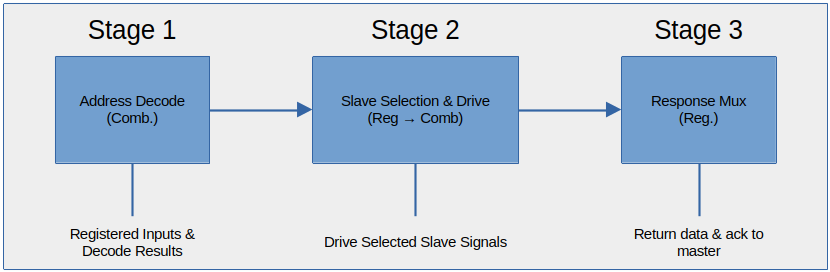

# Wishbone Interconnect Design Document

## 1. Architecture Overview

The Wishbone Interconnect is a **pipelined 3-stage bus fabric** that connects a single Wishbone master (CPU) to multiple Wishbone slaves (memory and peripherals). The design features: 

- **3-stage pipeline** for better timing closure
- **Configurable memor**y sizes via parameters
- **Error handling** for invalid addresses
- **Debug and monitoring** capabilities
- **Read-only IMEM** protection

## 2. Memory Map

The interconnect supports configurable memory regions with default sizes: 

| Slave         | Base Address  | Default Size  | Address Range                    | Access Mode    |
|---------------|---------------|---------------|----------------------------------|----------------|
| **IMEM**      | `0x0000_0000` | 8 KB          | `0x0000_0000` -- `0x0000_1FFF`   | Read-only      |
| **DMEM**      | `0x1000_0000` | 4 KB          | `0x1000_0000` -- `0x1000_0FFF`   | Read/Write     |
| **UART**      | `0x2000_0000` | 4 KB          | `0x2000_0000` -- `0x2000_0FFF`   | Read/Write     |
| **TIMER**     | `0x3000_0000` | 4 KB          | `0x3000_0000` -- `0x3000_0FFF`   | Read/Write     |
| **GPIO**      | `0x4000_0000` | 4 KB          | `0x4000_0000` -- `0x4000_0FFF`   | Read/Write     |


**Note**: Memory sizes are configurable via module parameters.


## 3. Interface Signals
### 3.1 Master Interface (CPU &rarr; Interconnect)


| Signals               | Direction         | Width     | Description                     |
|-----------------------|-------------------|-----------|---------------------------------|
| `clk`                 | **input**         | 1         | System Clock                    |
| `rst_n`               | **input**         | 1         | Active-low Reset                |
| `wbm_cpu_cyc`         | **input**         | 1         | Bus cycle active                |
| `wbm_cpu_stb`         | **input**         | 1         | Strobe signal (valid request)   |
| `wbm_cpu_we`          | **input**         | 1         | Write enable (1=write, 0=read)  |
| `wbm_cpu_addr`        | **input**         | 32        | Address Bus                     |
| `wbm_cpu_data_write`  | **input**         | 32        | Write data bus                  |
| `wbm_cpu_sel`         | **input**         | 4         | Byte select                     |
| `wbm_cpu_data_read`   | **output**        | 32        | Read data bus                   |
| `wbm_cpu_ack`         | **output**        | 1         | Acknowledge from slave          |


### 3.2 Slave Interfaces (Interconnect &rarr; Peripherals)


| Signal Group          | Direction         | Width     | Example Signal Name           |
|-----------------------|-------------------|-----------|-------------------------------|
| Control to Slave      | **output**        | 1         | `wbs_imem_cyc`                |
| Control to Slave      | **output**        | 1         | `wbs_imem_stb`                |
| Control to Slave      | **output**        | 1         | `wbs_imem_we`                 |
| Address to Slave      | **output**        | 32        | `wbs_imem_addr`               |
| Data to Slave         | **output**        | 32        | `wbs_imem_data_write`         |
| Byte Select           | **output**        | 4         | `wbs_imem_sel`                |
| Data from Slave       | **input**         | 32        | `wbs_imem_data_read`          |
| Acknowledge           | **input**         | 1         | `wbs_imem_ack`                |

**Note**: Signal names follow the pattern `wbs_[slave]_*` where `[slave]` is one of: `imem`, `dmem`, `uart`, `timer`, `gpio`.

## 4. Module Parameters

```verilog
module wishbone_interconnect #(
    parameter ADDR_WIDTH        = 32,    // Address bus width
    parameter DATA_WIDTH        = 32,    // Data bus width
    parameter IMEM_SIZE_KB      = 8,     // IMEM size in KB (default: 8)
    parameter DMEM_SIZE_KB      = 4,     // DMEM size in KB (default: 4)
    parameter PERIPH_SIZE_KB    = 4      // Peripheral size in KB (default: 4)
)
```

## 5. Pipeline Architecture
### 5.1 Three-Stage Pipeline




### 5.2 Stage 1: Combinational Address Decode


```verilog
// Input: wbm_cpu_addr (from master)
// Output: sel_slave_combo, address_valid_combo

always @(*) begin
    // Defaults
    sel_slave_combo = SLAVE_NONE;
    address_valid_combo = 1'b0;
    
    // Range-based address decoding
    if (wbm_cpu_addr >= IMEM_BASE_ADDR && wbm_cpu_addr <= IMEM_END_ADDR) begin
        sel_slave_combo   = SLAVE_IMEM;
        address_valid_combo = 1'b1;
    end 
    // Similar for DMEM, UART, TIMER, GPIO
    else begin
        sel_slave_combo = SLAVE_NONE;
        address_valid_combo = 1'b0;
    end
end
```

### 5.3 Stage 2: Registered Slave Drive

At positive clock edge:
- Register decoded slave selection
- Register address valid flag
- Register all master inputs

Then combinationally drive selected slave:

```verilog
always @(*) begin
    // Default all slave outputs to inactive
    wbs_imem_cyc = 1'b0;
    // ... other slaves default to 0
    
    // Drive selected slave if request is active and address valid
    if (request_active_reg && address_valid_reg) begin
        case (sel_slave_reg)
            SLAVE_IMEM: begin
                wbs_imem_cyc = 1'b1;
                wbs_imem_stb = 1'b1;
                wbs_imem_we  = 1'b0;  // IMEM is READ-ONLY
                // ... other signals
            end
            // ... other slaves
        endcase
    end
end
```

**Important**: IMEM is **read-only** &rarr; `wbs_imem_we` is always forced to 0.

### 5.4 Stage 3: Registered Response Mux


```verilog
always @(posedge clk) begin
    if (!rst_n) begin
        wbm_cpu_ack <= 1'b0;
        wbm_cpu_data_read <= 0;
    end else begin
        if (request_active_reg) begin
            if (address_valid_reg) begin
                // Valid address - wait for slave ACK
                case (sel_slave_reg)
                    SLAVE_IMEM: begin
                        wbm_cpu_ack <= wbs_imem_ack;
                        wbm_cpu_data_read <= wbs_imem_data_read;
                    end
                    // ... other slaves
                endcase
            end else begin
                // Invalid address - respond immediately
                wbm_cpu_ack <= 1'b1;
                wbm_cpu_data_read <= 32'hDEAD_BEEF;
            end
        end
    end
end
```

## 6. Timing Characteristics

| Operation Type        | Latency       | Description                     |
|-----------------------|---------------|---------------------------------|
| **Valid Access**      | 2 cycles      | Stage 1: Decode (combinational)<br>Stage 2: Drive slave (registered→comb)<br>Stage 3: Return response (registered)                           |
| **Invalid Address**   | 2 cycles      | Same as valid access, but returns error response immediately |
| **Back-to-back**      | 1 cycle       | Pipelined operation allows new request every cycle |
| **Slave Response**    | Variable      | Additional cycles if slave takes multiple cycles to respond |


## 7. Error Handling
### 7.1 Invalid Address Response
- **ACK**: Asserted in next cycle after invalid address detected
- **Data**: Return `32'hDEAD_BEEF`
- **Condition**: Address outside all defined memory regions


### 7.2 IMEM Write Protection
- **Behavior**: Write enable (`we`) forced to 0 for IMEM
- **Purpose**: Prevent accidental instruction memory corruption
- **Note**: Write data and address still forwarded (but ignored by slave)


### 7.3 Unselected Slave Case
- **Behavior**: Returns `32'hBADADD01` with ACK (should never occur)
- **Condition**: `address_valid_reg` is true but no slave selected


## 8. Debug and Monitoring Features

```verilog
// Enabled only during simulation (synthesis translate_off)

// 1. Access counting
reg [31:0] access_count;   // Total successful accesses
reg [31:0] error_count;    // Invalid address errors

// 2. Combinatorial loop detection
// Warns if STB and ACK are asserted simultaneously for many cycles

// 3. Error reporting
$display("[INTERCONNECT] Error: Invalid address %h at time %t", 
         wbm_cpu_addr_reg, $time);
```


## 9. Design Considerations

### 9.1 Performance
- **Pipeline design** enables 1 request per cycle throughput
- **Combinational decode** minimizes critical path
- *Registered responses* ensure clean timing


### 9.2 Flexibility
- **Parameterized sizes** for different system configuration
- **Easy to add slaves** by extending address decode logic
- **Standard Wishbone B4** interface for compatibility


### 9.3 Safety
- **IMEM write protection** prevents accidental corruption
- **Error responses** for invalid address
- **Reset initialization** of all state elements


### 9.4 Verification
- **Debug counters** for access monitoring
- **Loop detection** for protocol violation checking
- **Simulation-only constructs** for verification without hardware cost


## 10. Testbench Requirements and Verification Plan
### 10.1 Design-Specific Behavior Notes

#### Byte Select (SEL) Signal Usage
In this system, the **SEL[3:0]** signals have asymmetric behavior:


| Operation     | SEL Usage         | Responsability                                                |
|---------------|-------------------|---------------------------------------------------------------|
| **Write**     | **Respected**     | Slave must only write bytes where SEL[i]=1                    |
| **Read**      | **Ignored**       | Slave returns full 32-bit word; CPU extracts needed bytes     |

Rationale: The CPU's `mem_stage` handles byte/halfword extraction from the full 32-bit read data, simplifying slave implementations.

#### Testbench Implications
1. Slave models must:
- Respect SEL on writes (masked write)
- Ignore SEL on reads (return full word)

2. Test cases must verify:
- Write with partial SEL works correctly
- Read with any SEL returns full word
- CPU-like extraction not tested at interconnect level

